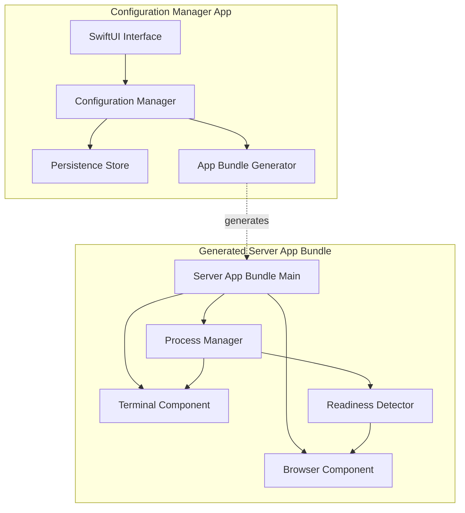
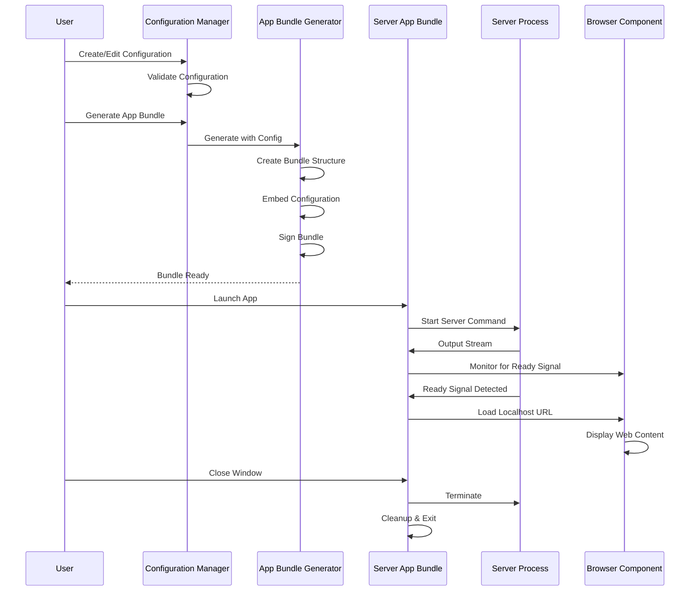
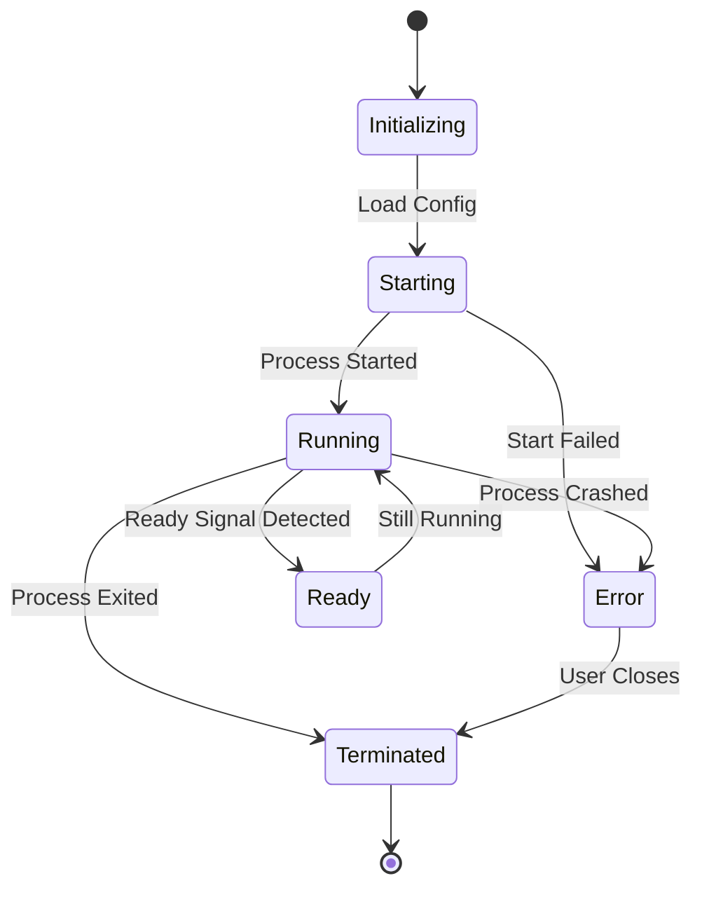
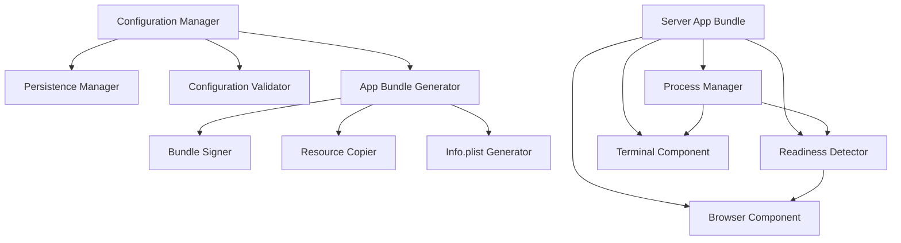

# Design Document: Local Server Wrapper

## Overview

The Local Server Wrapper is a macOS application system consisting of two main components:

1. **Configuration Manager**: A SwiftUI-based macOS application that provides a user interface for creating, editing, and managing server configurations, and generating standalone app bundles.

2. **Server App Bundle**: Standalone, sandboxed macOS .app bundles that wrap individual server configurations, providing an integrated terminal and browser interface in a single window.

### Technology Stack

- **Language**: Swift 5.9+
- **UI Framework**: SwiftUI (macOS 13.0+)
- **Process Management**: Foundation `Process` (formerly `NSTask`)
- **Web Rendering**: WebKit `WKWebView`
- **Persistence**: Core Data or JSON file storage
- **Sandboxing**: macOS App Sandbox with appropriate entitlements

### Key Design Principles

1. **Self-Contained Bundles**: Each generated app bundle must be completely independent and relocatable
2. **Unified Interface**: Terminal and browser components share a single window with split-view layout
3. **Lifecycle Management**: Server process and UI components have coordinated lifecycle
4. **Configuration-Driven**: All behavior is determined by embedded configuration data
5. **Sandboxed Security**: Both Configuration Manager and generated bundles run in App Sandbox

## Architecture

### High-Level Architecture



### Component Interaction Flow



## Components and Interfaces

### 1. Configuration Manager

The Configuration Manager is the primary user-facing application for managing server configurations.

#### 1.1 Configuration Manager Core

**Responsibilities:**
- Manage CRUD operations for server configurations
- Validate configuration data
- Coordinate with App Bundle Generator
- Persist configurations to disk

**Interface:**
```swift
protocol ConfigurationManagerProtocol {
    func createConfiguration(_ config: ServerConfiguration) throws
    func updateConfiguration(_ config: ServerConfiguration) throws
    func deleteConfiguration(id: UUID) throws
    func listConfigurations() -> [ServerConfiguration]
    func getConfiguration(id: UUID) -> ServerConfiguration?
    func generateAppBundle(for configId: UUID, outputPath: URL) async throws
}
```

#### 1.2 Configuration Validator

**Responsibilities:**
- Validate required fields
- Validate regex patterns
- Check for duplicate names
- Validate file paths and URLs

**Interface:**
```swift
protocol ConfigurationValidatorProtocol {
    func validate(_ config: ServerConfiguration) throws
    func validateRegexPattern(_ pattern: String) throws
    func validateCommand(_ command: String) throws
    func validateURL(_ url: String) throws
}

enum ValidationError: Error {
    case missingRequiredField(String)
    case invalidRegexPattern(String)
    case duplicateName(String)
    case invalidCommand(String)
    case invalidURL(String)
}
```

#### 1.3 Persistence Manager

**Responsibilities:**
- Save and load configurations from disk
- Handle migration between versions
- Ensure data integrity

**Interface:**
```swift
protocol PersistenceManagerProtocol {
    func save(_ configurations: [ServerConfiguration]) throws
    func load() throws -> [ServerConfiguration]
    func backup() throws
    func restore(from backupURL: URL) throws
}
```

**Storage Format:**
- JSON file at `~/Library/Application Support/LocalServerWrapper/configurations.json`
- Each configuration stored as a JSON object with all fields
- Atomic writes to prevent corruption

### 2. App Bundle Generator

The App Bundle Generator creates standalone .app bundles from server configurations.

#### 2.1 Bundle Generator Core

**Responsibilities:**
- Create macOS .app bundle directory structure
- Generate Info.plist with proper metadata
- Embed configuration data
- Copy executable and resources
- Sign the bundle with entitlements

**Interface:**
```swift
protocol AppBundleGeneratorProtocol {
    func generate(
        configuration: ServerConfiguration,
        outputPath: URL,
        progressHandler: ((Double, String) -> Void)?
    ) async throws -> URL
}

enum GenerationError: Error {
    case invalidOutputPath
    case bundleCreationFailed(String)
    case resourceCopyFailed(String)
    case signingFailed(String)
    case configurationEmbedFailed(String)
}
```

#### 2.2 Bundle Structure

Generated app bundle structure:
```
MyServer.app/
├── Contents/
│   ├── Info.plist
│   ├── MacOS/
│   │   └── ServerAppBundle (executable)
│   ├── Resources/
│   │   ├── AppIcon.icns
│   │   └── configuration.json (embedded config)
│   ├── _CodeSignature/
│   │   └── CodeResources
│   └── embedded.provisionprofile (if needed)
```

#### 2.3 Info.plist Generation

**Key Fields:**
```xml
<key>CFBundleIdentifier</key>
<string>com.localserverwrapper.generated.{config-id}</string>
<key>CFBundleName</key>
<string>{configuration-name}</string>
<key>CFBundleExecutable</key>
<string>ServerAppBundle</string>
<key>CFBundleIconFile</key>
<string>AppIcon</string>
<key>LSMinimumSystemVersion</key>
<string>13.0</string>
<key>NSHighResolutionCapable</key>
<true/>
```

#### 2.4 Entitlements

Required entitlements for sandboxed operation:
```xml
<?xml version="1.0" encoding="UTF-8"?>
<!DOCTYPE plist PUBLIC "-//Apple//DTD PLIST 1.0//EN" "http://www.apple.com/DTDs/PropertyList-1.0.dtd">
<plist version="1.0">
<dict>
    <key>com.apple.security.app-sandbox</key>
    <true/>
    <key>com.apple.security.network.client</key>
    <true/>
    <key>com.apple.security.network.server</key>
    <true/>
    <key>com.apple.security.files.user-selected.read-write</key>
    <true/>
</dict>
</plist>
```

### 3. Server App Bundle

The Server App Bundle is the generated standalone application that wraps a server configuration.

#### 3.1 App Bundle Main

**Responsibilities:**
- Load embedded configuration
- Initialize UI components
- Coordinate component lifecycle
- Handle window management

**Interface:**
```swift
@main
struct ServerAppBundleApp: App {
    @StateObject private var appState: AppState
    
    init() {
        let config = ConfigurationLoader.loadEmbeddedConfiguration()
        _appState = StateObject(wrappedValue: AppState(configuration: config))
    }
    
    var body: some Scene {
        WindowGroup {
            ContentView()
                .environmentObject(appState)
        }
        .commands {
            CommandGroup(replacing: .newItem) { }
        }
    }
}
```

#### 3.2 Process Manager

**Responsibilities:**
- Start and stop server process
- Capture stdout and stderr
- Monitor process state
- Handle process termination

**Interface:**
```swift
protocol ProcessManagerProtocol: ObservableObject {
    var isRunning: Bool { get }
    var exitCode: Int32? { get }
    var output: String { get }
    
    func start(command: String, arguments: [String]) throws
    func terminate()
    func forceKill()
}

class ProcessManager: ProcessManagerProtocol {
    private var process: Process?
    private var outputPipe: Pipe
    private var errorPipe: Pipe
    @Published var isRunning: Bool = false
    @Published var exitCode: Int32?
    @Published var output: String = ""
    
    // Implementation details...
}
```

**Implementation Notes:**
- Use `Process` (formerly `NSTask`) for subprocess execution
- Use `Pipe` for capturing stdout/stderr
- Use `NotificationCenter` to observe process termination
- Stream output incrementally to avoid memory issues
- Support interactive input via stdin pipe

#### 3.3 Terminal Component

**Responsibilities:**
- Display server process output
- Support scrolling and text selection
- Highlight errors
- Show process state

**Interface:**
```swift
struct TerminalView: View {
    @ObservedObject var processManager: ProcessManager
    @State private var scrollProxy: ScrollViewProxy?
    
    var body: some View {
        ScrollViewReader { proxy in
            ScrollView {
                Text(processManager.output)
                    .font(.system(.body, design: .monospaced))
                    .textSelection(.enabled)
                    .frame(maxWidth: .infinity, alignment: .leading)
                    .padding()
            }
            .background(Color.black)
            .foregroundColor(Color.green)
        }
    }
}
```

**Features:**
- Monospaced font for terminal output
- Auto-scroll to bottom on new output
- Text selection support
- ANSI color code support (optional enhancement)
- Search functionality (optional enhancement)

#### 3.4 Readiness Detector

**Responsibilities:**
- Monitor terminal output for ready signal
- Extract port numbers from output
- Construct final URL
- Notify when server is ready

**Interface:**
```swift
protocol ReadinessDetectorProtocol: ObservableObject {
    var isReady: Bool { get }
    var detectedURL: URL? { get }
    
    func monitor(output: String)
    func reset()
}

class ReadinessDetector: ReadinessDetectorProtocol {
    private let readySignalPattern: String?
    private let portDetectionPattern: String?
    private let baseURL: String
    
    @Published var isReady: Bool = false
    @Published var detectedURL: URL?
    
    func monitor(output: String) {
        // Check for ready signal
        // Extract port if pattern provided
        // Construct URL
        // Set isReady = true
    }
}
```

**Implementation Notes:**
- Use `NSRegularExpression` for pattern matching
- Support both static URLs and dynamic port detection
- Handle timeout scenarios
- Thread-safe output monitoring

#### 3.5 Browser Component

**Responsibilities:**
- Display web content
- Handle navigation
- Provide browser controls
- Handle connection errors

**Interface:**
```swift
struct BrowserView: View {
    @ObservedObject var readinessDetector: ReadinessDetector
    @StateObject private var webViewModel = WebViewModel()
    
    var body: some View {
        VStack(spacing: 0) {
            BrowserToolbar(viewModel: webViewModel)
            WebView(viewModel: webViewModel)
        }
    }
}

class WebViewModel: ObservableObject {
    @Published var url: URL?
    @Published var canGoBack: Bool = false
    @Published var canGoForward: Bool = false
    @Published var isLoading: Bool = false
    @Published var currentURL: String = ""
    
    func load(url: URL)
    func goBack()
    func goForward()
    func reload()
}
```

**WebView Implementation:**
```swift
struct WebView: NSViewRepresentable {
    @ObservedObject var viewModel: WebViewModel
    
    func makeNSView(context: Context) -> WKWebView {
        let webView = WKWebView()
        webView.navigationDelegate = context.coordinator
        return webView
    }
    
    func updateNSView(_ webView: WKWebView, context: Context) {
        if let url = viewModel.url, webView.url != url {
            webView.load(URLRequest(url: url))
        }
    }
    
    func makeCoordinator() -> Coordinator {
        Coordinator(viewModel: viewModel)
    }
    
    class Coordinator: NSObject, WKNavigationDelegate {
        // Handle navigation events
    }
}
```

#### 3.6 Split View Layout

**Responsibilities:**
- Manage terminal and browser layout
- Support resizable split
- Persist split position

**Interface:**
```swift
struct ContentView: View {
    @EnvironmentObject var appState: AppState
    @State private var splitPosition: CGFloat = 0.3
    
    var body: some View {
        HSplitView {
            TerminalView(processManager: appState.processManager)
                .frame(minWidth: 200)
            
            BrowserView(readinessDetector: appState.readinessDetector)
                .frame(minWidth: 400)
        }
        .onAppear {
            appState.processManager.start(
                command: appState.configuration.command,
                arguments: appState.configuration.arguments
            )
        }
    }
}
```

## Data Models

### ServerConfiguration

The core data model representing a server configuration.

```swift
struct ServerConfiguration: Codable, Identifiable {
    let id: UUID
    var name: String
    var command: String
    var arguments: [String]
    var localhostURL: String?
    var readySignalPattern: String?
    var portDetectionPattern: String?
    var customIconPath: String?
    var createdAt: Date
    var updatedAt: Date
    
    init(
        id: UUID = UUID(),
        name: String,
        command: String,
        arguments: [String] = [],
        localhostURL: String? = nil,
        readySignalPattern: String? = nil,
        portDetectionPattern: String? = nil,
        customIconPath: String? = nil
    ) {
        self.id = id
        self.name = name
        self.command = command
        self.arguments = arguments
        self.localhostURL = localhostURL
        self.readySignalPattern = readySignalPattern
        self.portDetectionPattern = portDetectionPattern
        self.customIconPath = customIconPath
        self.createdAt = Date()
        self.updatedAt = Date()
    }
}
```

### AppState

Runtime state for the Server App Bundle.

```swift
class AppState: ObservableObject {
    let configuration: ServerConfiguration
    @Published var processManager: ProcessManager
    @Published var readinessDetector: ReadinessDetector
    @Published var showCloseConfirmation: Bool = false
    
    init(configuration: ServerConfiguration) {
        self.configuration = configuration
        self.processManager = ProcessManager()
        self.readinessDetector = ReadinessDetector(
            readySignalPattern: configuration.readySignalPattern,
            portDetectionPattern: configuration.portDetectionPattern,
            baseURL: configuration.localhostURL ?? "http://localhost:3000"
        )
        
        // Connect process output to readiness detector
        processManager.$output
            .sink { [weak self] output in
                self?.readinessDetector.monitor(output: output)
            }
            .store(in: &cancellables)
    }
    
    private var cancellables = Set<AnyCancellable>()
}
```

## Correctness Properties

*A property is a characteristic or behavior that should hold true across all valid executions of a system—essentially, a formal statement about what the system should do. Properties serve as the bridge between human-readable specifications and machine-verifiable correctness guarantees.*

### Property 1: Configuration Persistence Round-Trip

*For any* set of valid server configurations, saving them to disk and then loading them back should produce an equivalent set of configurations with all fields preserved.

**Validates: Requirements 1.5, 11.1, 11.6**

### Property 2: Unique Name Validation

*For any* list of existing server configurations and any new configuration name, the validation logic should correctly identify whether the name is a duplicate, rejecting duplicates and accepting unique names.

**Validates: Requirements 1.6**

### Property 3: Required Field Validation

*For any* server configuration with various combinations of missing required fields, the validator should correctly identify all missing required fields and reject configurations that lack any required field.

**Validates: Requirements 2.6**

### Property 4: Bundle Structure Validity

*For any* valid server configuration, generating an app bundle should produce a directory structure that conforms to macOS .app bundle requirements (Contents/, MacOS/, Resources/, Info.plist).

**Validates: Requirements 3.1**

### Property 5: Configuration Embedding Round-Trip

*For any* valid server configuration, embedding it into an app bundle and then extracting it should produce an equivalent configuration with all settings preserved.

**Validates: Requirements 3.2**

### Property 6: Ready Signal Pattern Matching

*For any* terminal output string and any valid regular expression pattern, the readiness detector should correctly identify whether the pattern matches the output, with no false positives or false negatives for valid regex patterns.

**Validates: Requirements 5.1**

### Property 7: Port Extraction from Output

*For any* terminal output string containing a port number and any valid port detection regex pattern, the port extractor should correctly extract the port number when present, or return no match when absent.

**Validates: Requirements 9.1**

### Property 8: URL Construction from Port

*For any* base URL string and any valid port number (1-65535), constructing a localhost URL should produce a valid URL string in the format "protocol://localhost:port" that can be parsed back into its components.

**Validates: Requirements 9.2**

### Property 9: Bundle Relocatability

*For any* valid filesystem path where the user has write permissions, moving a generated app bundle to that location should not affect the bundle's ability to launch and execute its embedded configuration.

**Validates: Requirements 10.3**

### Property 10: Configuration Update Persistence

*For any* existing server configuration and any valid modification to its fields, saving the updated configuration and then loading it back should preserve all the modifications.

**Validates: Requirements 11.2**

### Property 11: Current Settings Usage in Regeneration

*For any* server configuration that has been modified since the last bundle generation, regenerating the app bundle should embed the current configuration state, not any previous state.

**Validates: Requirements 11.4**


## Error Handling

### Error Categories

#### 1. Configuration Errors

**Validation Errors:**
- Missing required fields
- Invalid regex patterns
- Duplicate configuration names
- Invalid file paths
- Malformed URLs

**Handling Strategy:**
- Display inline validation errors in the UI
- Prevent progression until errors are resolved
- Provide helpful error messages with correction suggestions
- Validate on field blur and before save/generate operations

#### 2. Generation Errors

**Bundle Creation Errors:**
- Invalid output path
- Insufficient permissions
- Disk space exhausted
- Bundle structure creation failure
- Resource copy failure
- Code signing failure

**Handling Strategy:**
- Display modal error dialog with detailed message
- Log full error details for debugging
- Offer retry option where applicable
- Provide fallback to manual bundle creation
- Clean up partial bundles on failure

#### 3. Runtime Errors (Server App Bundle)

**Process Errors:**
- Command not found
- Permission denied
- Process crash
- Non-zero exit code

**Handling Strategy:**
- Display error in terminal component with highlighting
- Show exit code prominently
- Keep terminal visible for debugging
- Provide option to restart process
- Log errors to system console

**Readiness Detection Errors:**
- Ready signal timeout
- Invalid regex pattern at runtime
- Port detection failure

**Handling Strategy:**
- Display timeout notification after configurable period (default: 30s)
- Offer manual browser open option
- Fall back to static URL if port detection fails
- Log detection attempts for debugging

**Browser Errors:**
- Connection refused
- Network error
- Invalid URL
- SSL/TLS errors

**Handling Strategy:**
- Display WKWebView error page
- Provide retry button
- Show connection details
- Offer option to open in external browser

#### 4. Persistence Errors

**File System Errors:**
- Read/write permission denied
- Disk full
- File corruption
- JSON parsing errors

**Handling Strategy:**
- Display error alert with specific issue
- Attempt automatic backup before write operations
- Provide manual backup/restore options
- Validate JSON structure before parsing
- Use atomic writes to prevent corruption

### Error Recovery Strategies

**Graceful Degradation:**
- If custom icon fails to load, use default icon
- If port detection fails, use static URL
- If ready signal times out, allow manual browser open
- If history tracking fails, continue without history

**User Notification:**
- Use native macOS alerts for critical errors
- Use inline validation for form errors
- Use status bar for informational messages
- Use console logging for debugging information

**Logging:**
- Log all errors to system console using `os_log`
- Include context (configuration ID, operation, timestamp)
- Use appropriate log levels (error, warning, info, debug)
- Respect user privacy (no sensitive data in logs)

## Testing Strategy

### Overview

The testing strategy employs a dual approach combining property-based testing for pure logic components and example-based testing for UI, integration, and infrastructure concerns.

### Property-Based Testing

**Framework:** [Swift-Check](https://github.com/typelift/SwiftCheck) or [swift-check](https://github.com/pointfreeco/swift-composable-architecture)

**Configuration:**
- Minimum 100 iterations per property test
- Shrinking enabled for minimal failing examples
- Deterministic seed for reproducibility
- Timeout: 60 seconds per property

**Test Organization:**
```swift
// Feature: local-server-wrapper, Property 1: Configuration Persistence Round-Trip
func testConfigurationPersistenceRoundTrip() {
    property("For any set of configurations, save then load preserves data") <- forAll { (configs: [ServerConfiguration]) in
        let manager = PersistenceManager()
        try? manager.save(configs)
        let loaded = try? manager.load()
        return loaded == configs
    }
}
```

**Property Test Coverage:**

1. **Configuration Persistence Round-Trip** (Property 1)
   - Generator: Array of random ServerConfiguration objects
   - Assertion: `save(configs) → load() == configs`
   - Edge cases: Empty array, single config, many configs

2. **Unique Name Validation** (Property 2)
   - Generator: Array of configs + new config name
   - Assertion: Validator correctly identifies duplicates
   - Edge cases: Case sensitivity, whitespace, special characters

3. **Required Field Validation** (Property 3)
   - Generator: Configs with various missing fields
   - Assertion: Validator catches all missing required fields
   - Edge cases: All fields missing, one field missing, optional fields

4. **Bundle Structure Validity** (Property 4)
   - Generator: Random valid configurations
   - Assertion: Generated bundle has required directories and files
   - Edge cases: Special characters in names, long names

5. **Configuration Embedding Round-Trip** (Property 5)
   - Generator: Random ServerConfiguration objects
   - Assertion: `embed(config) → extract() == config`
   - Edge cases: Special characters, large configs

6. **Ready Signal Pattern Matching** (Property 6)
   - Generator: Output strings + regex patterns
   - Assertion: Pattern matching is correct
   - Edge cases: Empty strings, multiline, special regex chars

7. **Port Extraction from Output** (Property 7)
   - Generator: Output strings with/without ports + patterns
   - Assertion: Correct port extracted or no match
   - Edge cases: Multiple ports, invalid ports, edge port numbers

8. **URL Construction from Port** (Property 8)
   - Generator: Base URLs + port numbers (1-65535)
   - Assertion: Constructed URL is valid and parseable
   - Edge cases: Port 1, port 65535, various protocols

9. **Bundle Relocatability** (Property 9)
   - Generator: Valid filesystem paths
   - Assertion: Bundle works after relocation
   - Edge cases: Paths with spaces, deep nesting, symlinks

10. **Configuration Update Persistence** (Property 10)
    - Generator: Config + random field modifications
    - Assertion: `update(config) → save() → load() == updated config`
    - Edge cases: Multiple updates, all fields changed

11. **Current Settings Usage in Regeneration** (Property 11)
    - Generator: Config + modifications + regeneration
    - Assertion: Regenerated bundle uses current settings
    - Edge cases: Multiple regenerations, rapid changes

### Example-Based Unit Testing

**Framework:** XCTest

**Coverage:**

**UI Components:**
- Configuration list display
- Form field interactions
- Button actions
- Modal dialogs
- Split view layout
- Terminal output display
- Browser toolbar

**Specific Scenarios:**
- Creating first configuration
- Editing existing configuration
- Deleting configuration with confirmation
- Generating bundle to specific location
- Launching bundle without ready signal
- Closing bundle with running process
- Process exit with non-zero code
- Ready signal timeout
- Custom icon vs default icon

**Edge Cases:**
- Empty configuration list
- Maximum field lengths
- Special characters in names
- Invalid regex patterns
- Network errors in browser
- Process that never outputs ready signal

### Integration Testing

**Framework:** XCTest with XCUITest for UI automation

**Test Scenarios:**

1. **End-to-End Bundle Generation:**
   - Create configuration in manager
   - Generate bundle
   - Launch bundle independently
   - Verify server starts and browser opens
   - Close bundle and verify cleanup

2. **Process Management:**
   - Start various server commands (npm, python, ruby)
   - Verify output capture
   - Test interactive input
   - Verify termination handling

3. **Browser Integration:**
   - Load localhost URLs
   - Test navigation (back, forward, refresh)
   - Verify JavaScript execution
   - Test connection error handling

4. **Sandboxing:**
   - Verify container creation
   - Test file access restrictions
   - Verify entitlements are enforced
   - Test multiple bundles isolation

5. **Persistence:**
   - Save configurations
   - Restart application
   - Verify configurations loaded
   - Test backup/restore

### Smoke Testing

**Purpose:** Verify basic functionality after builds

**Test Cases:**
1. Configuration Manager launches successfully
2. Can create a new configuration
3. Can generate a bundle
4. Generated bundle launches
5. Bundle has correct entitlements
6. Bundle creates container

### Performance Testing

**Metrics:**
- Bundle generation time (target: < 5 seconds)
- Configuration load time (target: < 1 second for 100 configs)
- Terminal output rendering (target: 60 FPS for streaming output)
- Memory usage (target: < 100 MB for Configuration Manager, < 50 MB per bundle)

**Test Scenarios:**
- Generate bundle with large configuration
- Load 1000 configurations
- Stream high-volume terminal output
- Run 10 bundles simultaneously

### Test Data Generators

**For Property-Based Testing:**

```swift
extension ServerConfiguration: Arbitrary {
    public static var arbitrary: Gen<ServerConfiguration> {
        return Gen.compose { c in
            ServerConfiguration(
                name: c.generate(using: String.arbitrary),
                command: c.generate(using: Gen.fromElements(of: ["/bin/bash", "npm", "python3"])),
                arguments: c.generate(using: Gen.array(of: String.arbitrary)),
                localhostURL: c.generate(using: Gen.optional(URL.arbitrary)),
                readySignalPattern: c.generate(using: Gen.optional(String.arbitrary)),
                portDetectionPattern: c.generate(using: Gen.optional(String.arbitrary)),
                customIconPath: c.generate(using: Gen.optional(String.arbitrary))
            )
        }
    }
}
```

### Continuous Integration

**CI Pipeline:**
1. Run unit tests (property + example-based)
2. Run integration tests
3. Run smoke tests
4. Generate code coverage report (target: > 80%)
5. Run static analysis (SwiftLint)
6. Build release bundle
7. Run performance benchmarks

**Test Execution:**
- All tests run on every commit
- Integration tests run on PR
- Performance tests run nightly
- Manual smoke tests before release

### Manual Testing Checklist

**Before Release:**
- [ ] Test on clean macOS installation
- [ ] Verify all server types (Node, Python, Ruby, Go)
- [ ] Test with various terminal output patterns
- [ ] Verify sandboxing restrictions
- [ ] Test bundle relocation
- [ ] Verify icon display in Finder
- [ ] Test with multiple monitors
- [ ] Verify accessibility features
- [ ] Test with VoiceOver
- [ ] Verify keyboard navigation

## Implementation Notes

### Technology Decisions

**Why SwiftUI over AppKit:**
- Modern declarative UI paradigm
- Better state management with `@State` and `@ObservedObject`
- Easier to maintain and test
- Native support for split views and responsive layouts
- Future-proof for Apple platform evolution

**Why Process over NSTask:**
- `Process` is the modern Swift API
- Better integration with Swift concurrency
- Cleaner API surface
- NSTask is deprecated

**Why WKWebView over WebView:**
- WebView is deprecated
- WKWebView has better performance
- Better security model
- Modern web standards support
- Better memory management

**Why JSON over Core Data for Configuration Storage:**
- Simpler data model (no relationships)
- Easier to backup and restore
- Human-readable format
- No migration complexity
- Easier to debug

### Security Considerations

**Sandboxing:**
- All apps run in App Sandbox for security isolation
- Minimal entitlements (network client/server, user-selected files)
- No access to user data without explicit permission
- Each bundle has isolated container

**Code Signing:**
- All bundles must be signed
- Use hardened runtime
- Enable library validation
- Notarize for distribution outside App Store

**Input Validation:**
- Validate all user input (commands, URLs, regex patterns)
- Sanitize configuration data before embedding
- Validate bundle structure before execution
- Check file permissions before operations

**Process Isolation:**
- Server processes run in bundle's sandbox
- No access to Configuration Manager data
- Separate containers for each bundle
- Process termination on bundle close

### Accessibility

**VoiceOver Support:**
- All UI elements have accessibility labels
- Proper focus management
- Announce state changes
- Support for accessibility shortcuts

**Keyboard Navigation:**
- Full keyboard navigation support
- Logical tab order
- Keyboard shortcuts for common actions
- Escape key to cancel operations

**Visual Accessibility:**
- Support for system font sizes
- High contrast mode support
- Reduce motion support
- Color blind friendly error indicators

### Localization

**Initial Release:**
- English only

**Future Consideration:**
- Localize all UI strings
- Support for RTL languages
- Locale-specific date/time formatting
- Localized error messages

### Performance Optimizations

**Terminal Output:**
- Buffer output to reduce UI updates
- Limit stored output to last 10,000 lines
- Use virtual scrolling for large output
- Debounce output updates (16ms for 60 FPS)

**Configuration Loading:**
- Lazy load configurations
- Cache parsed configurations
- Use background thread for file I/O
- Incremental loading for large lists

**Bundle Generation:**
- Parallel resource copying
- Incremental signing
- Progress reporting
- Cancellation support

### Future Enhancements

**Potential Features:**
- Multiple terminal tabs in single bundle
- Environment variable configuration
- Pre-launch scripts
- Post-shutdown scripts
- Custom keyboard shortcuts
- Terminal themes
- Output filtering and search
- Export terminal output
- Bundle templates
- Configuration import/export
- Cloud sync for configurations
- Team sharing of configurations

## Diagrams

### State Machine: Server App Bundle Lifecycle



### Component Dependency Graph



## Conclusion

This design provides a comprehensive architecture for the Local Server Wrapper system, addressing all 12 requirements through well-defined components, interfaces, and data models. The dual testing strategy ensures both correctness of pure logic through property-based testing and proper integration of UI and system components through example-based and integration testing.

Key design strengths:
- **Modularity**: Clear separation of concerns between components
- **Testability**: Pure functions and protocols enable comprehensive testing
- **Security**: Sandboxing and minimal entitlements protect user data
- **User Experience**: Unified interface reduces cognitive load
- **Maintainability**: SwiftUI and modern Swift patterns ensure long-term viability

The implementation will proceed in phases:
1. Configuration Manager core functionality
2. App Bundle Generator
3. Server App Bundle runtime
4. Integration and polish
5. Testing and validation
